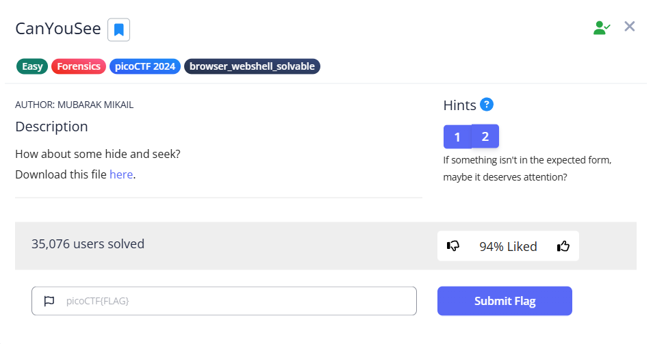
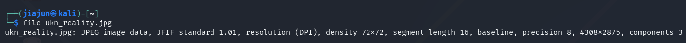
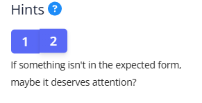
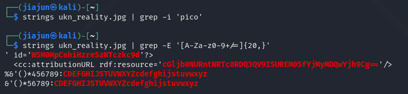
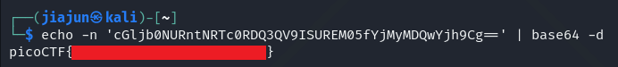

CTF name: CanYouSee

Challenge description: How about some hide and seek?

Challenge category: Forensics

Challenge points: Easy

## Step 1: Initial File Identification
First, run the `file` command on the downloaded file to confirm its type:
The result shows that `ukn_reality.jpg` is a standard JPEG image file, with no apparent multiple compression or nested file structure.

## Step 2: Searching for Hidden Data

The hint provided in the question is as follows:

Therefore, we use `strings` to extract printable strings from the image and `grep` to search for suspicious patterns:

A long string was discovered in the output:

## Step 3: Decoding the Flag

In Step 2, we extracted a suspicious string:

``bash
cGljb0NURntNRtCoRDQ3QV9ISUREM05fYjMyMDQwYjh9Cg==
``

Analysis of extracted strings:

The string consists solely of uppercase and lowercase letters, digits, and the character =;

Its length is a multiple of 4;

It terminates with the character =.

These are all typical features of Base64 encoding. It can therefore be inferred that this string is not a directly readable flag, but rather encoded hidden information.

Therefore, the next step is to decode it using Base64 to attempt to restore the actual flag content:

This output proves our guess was correct, and we finally get the flag using the `base64` command.

Here, the option `-n` in echo prevents it from appending a newline character, and `-d` in base64 tells the command to decode the input instead of encoding it.

