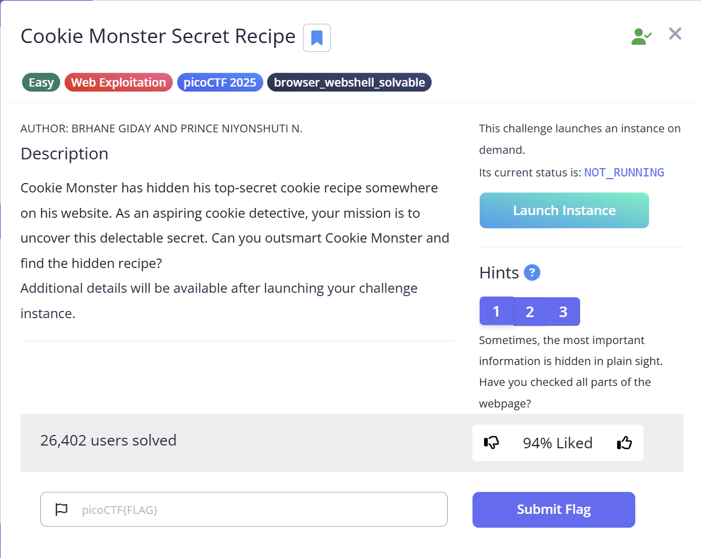
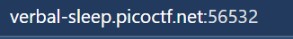
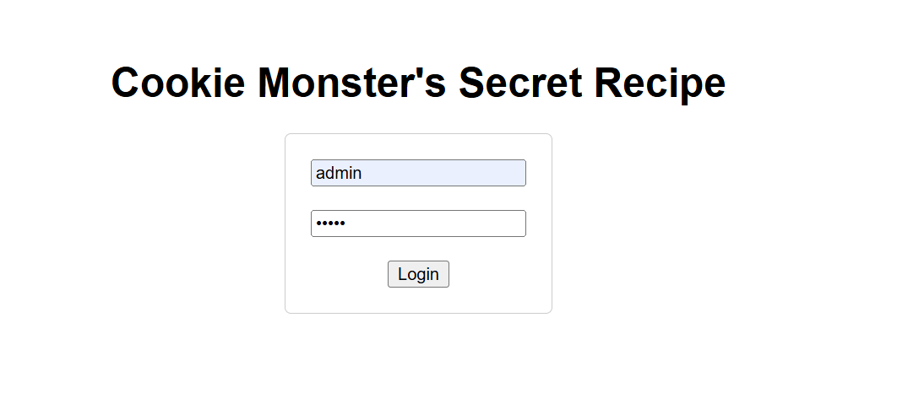
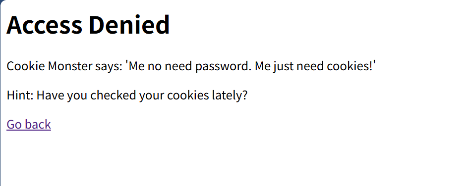
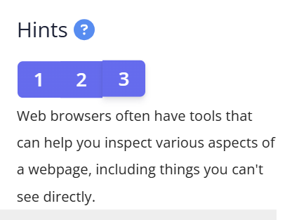
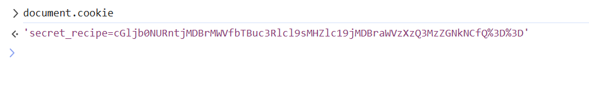

CTF name: Cookie Monster Secret Recipe

Challenge description: Cookie Monster has hidden his top-secret cookie recipe somewhere on his website. As an aspiring cookie detective, your mission is to uncover this delectable secret. Can you outsmart Cookie Monster and find the hidden recipe?

Challenge category: Web exploitation

Challenge points: Easy



## Step 1: Initial attempt

After entering arbitrary username and password into the login form and submitting, the page redirected to **Access Denied**.  
The prompt displayed:  

> Cookie Monster says: ‘Me no need password. Me just need cookies!’

> Hint: Have you checked your cookies lately?  

Conclusion: Standard credential input fails to log in. The system prompt emphasizes cookies; subsequent analysis should focus on cookies.





## Step 2: Cookie Obtain

Based on the challenge hints and the error message, it is clear that the login process is not about the username and password, but instead about inspecting hidden information — specifically cookies.  



After reaching the *Access Denied* page, open the browser Developer Tools and switched to the **Console** tab.

By typing the following command, the cookies for the current page can be retrieved:

```javascript
document.cookie
```

the result reveals a cookie named secret_recipe with a long encoded value



## Step 3: Cookie decode

The cookie value obtained in Step 2 was copied into a Base64 decoder.  



The cookie value obtained in Step 2 was a long string of seemingly random characters.  

On closer inspection, it matched the typical pattern of **Base64 encoding**:  

> It only contained letters (A–Z, a–z), digits, and a few symbols (`+`, `/`, `=`).
  
> It ended with `=` (or `%3D` in URL encoding), which is a strong indicator of Base64 padding.

Because of these features, the logical next step was to apply Base64 decoding.

After decoding, the hidden flag was revealed:


After decoding, the hidden flag was revealed:

picoCTF{c00k1e_m0nster_l0ves_c00kies_4736F6CB}
