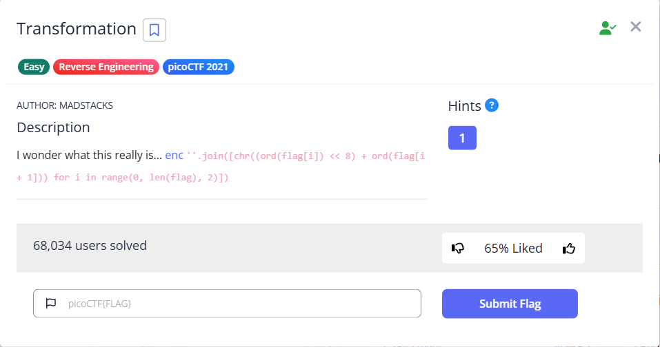

CTF name: Transformation

Challenge description: I wonder what this really is... enc ''.join([chr((ord(flag[i]) << 8) + ord(flag[i + 1])) for i in range(0, len(flag), 2)])

Challenge category: Reverse Engineering

Challenge points: Easy



## Step 1: Analysis of the Provided Code

The given code snippet demonstrates how the original flag is converted into an encoded string:

```bash
enc = ''.join([chr((ord(flag[i]) << 8) + ord(flag[i+1])) 
               for i in range(0, len(flag), 2)])
```

Here is the explanation of the code snippet:

`ord(flag[i])`: Converts the character at position i to its ASCII integer value.  

`ord(flag[i]) << 8`: Shifts the ASCII value left by 8 bits, which is equal to multiplying by 256. This operation places the value in the upper 8 bits of a 16-bit number.

`+ ord(flag[i+1])`: Adds the ASCII value of the next character, which occupies the lower 8 bits.

`chr(...)`: Converts this combined 16-bit value into a single Unicode character.

As a result, two original characters are packed into one Unicode character. The entire encoded string (enc) is therefore half the length of the original flag and consists of unusual symbols.

## Step 2：Decoding Script

To reverse this transformation, we need to unpack each Unicode character back into two ASCII characters by extracting the high and low 8 bits.

To decode the given enc file, we can implement the reverse process in Python：


Python script explanation：

For each encoded character in enc:

1. `ord(ch)`: Converts the encoded character into an integer value (16 bits).

2. `val >> 8`: Shifts the integer right by 8 bits, keeping only the high 8 bits, which gives the first character.

3. `val & 0xff`: Performs a bitwise AND with 0xff (binary 11111111), keeping only the low 8 bits, which gives the second character.

4. Both characters are concatenated into the flag.

## Step 3: Execute the script


Finally we get the flag!

