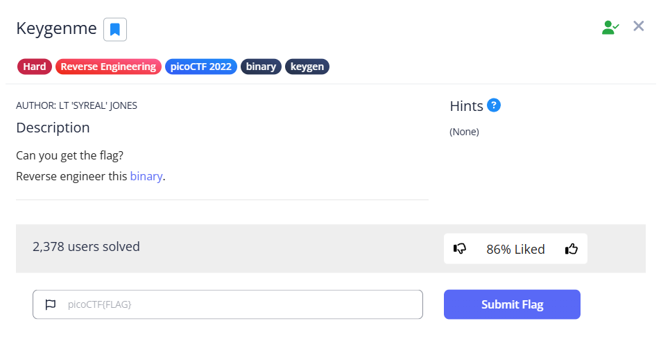
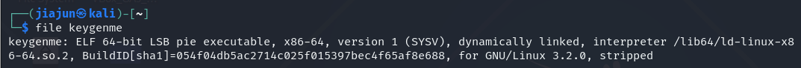
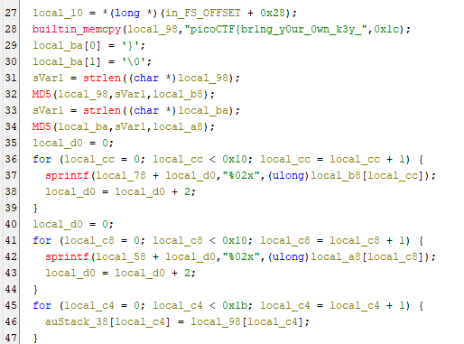
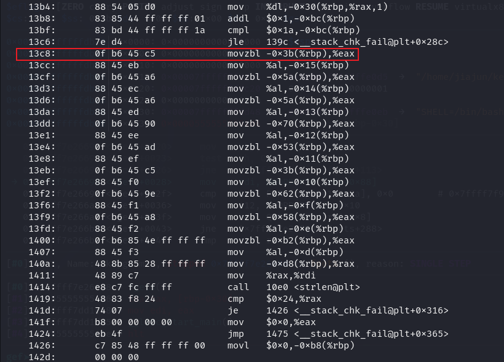
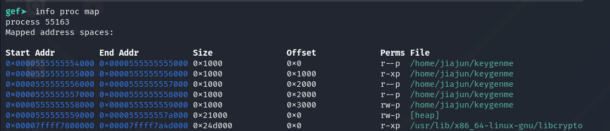
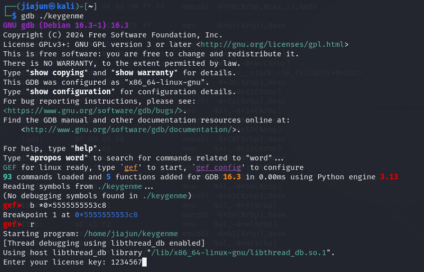
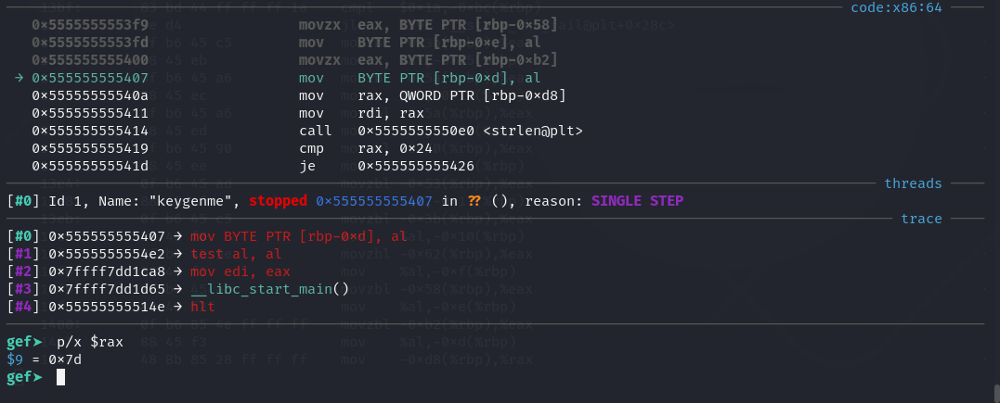

**CTF name**: Keygenme

**Challenge description**: Can you get the flag? Reverse engineer this binary.

**Challenge category**: Reverse Engineering

**Challenge points**: Hard



## step 1: Initial Analysis & Ghidra Reverse Engineering

After downloading the binary file `keygenme`, we first use the file command to check its properties:



The output reveals that this is a 64-bit stripped ELF PIE executable, dynamically linked.

Since it's PIE (Position-Independent Executable), all addresses will be ASLR-randomized, and we'll need to calculate the base address at runtime during debugging.

Next, open the binary in Ghidra to perform a static reverse engineering analysis.



In the decompiled main function, we found a hardcoded partial flag string assigned via memcpy:

```c
builtin_memcpy(local_98,"picoCTF{br1ng_y0ur_0wn_k3y_",0x1c);
```

Ghidra also reveals that two MD5 hashes are being computed and then used to construct the rest of the flag characters.

The final characters appear to be selected through a loop that accesses specific positions in memory — possibly comparing them to a correct solution or assembling the final result.

This gives a clear strategy:

The flag begins with a known prefix.

The remaining characters must be extracted dynamically, possibly by stepping through memory and comparing values during runtime.

## step 2: Find offset and base address

To begin the analysis, we need to find the instruction where the input characters are being processed. This allows us to set a proper breakpoint for dynamic analysis later.

We start by disassembling the binary using the following command:

```bash
objdump -d ./keygenme | less
```

This displays the disassembled instructions of the program, organized by segments. We're particularly interested in the .text section, which contains the main executable logic of the program.

By scrolling through the .text section, we can find a series of movzbl and mov instructions that access various offsets from %rbp. 



These instructions are strong indicators of the input-checking logic — they load individual bytes from the stack, which most likely contains the user input.

We record 0x13c8 as our offset, the relative address of this instruction within the binary.

However, this is not the actual runtime address. In the next step, we’ll add the base address of the binary to this offset to calculate the real address used in memory.



To determine the real address, we launch the binary inside gdb and stop execution by pressing `Ctrl + C`. 

Then, we run:

```bash
info proc map
```

This command shows the memory layout of the loaded binary. As shown in the image, the base address of the binary is: `0x0000555555554000`

As we got the base address and offset, we could calculate the actual runtime address: 0x555555554000 + 0x13c8 = 0x5555555553c8.

## step 3: Extracting Correct Characters to recover the flag

We have now calculated the actual runtime address from the base and offset. In gdb, we set a breakpoint at this address and run the program:



After hitting the breakpoint, we provide input and observe the disassembly window.

we can see several consecutive movzbl or mov instructions. These are responsible for loading the remaining characters of the flag into registers — meaning this is exactly the part we want to analyze further.

To extract the values, we use:

```bash
si           
x/p $rax    
```

This reveals the hex representation of each character being checked.



For instance, if $rax = 0x64, it corresponds to 'd' in ASCII. 

By repeating this process for each instruction, we can reconstruct the flag character by character.


