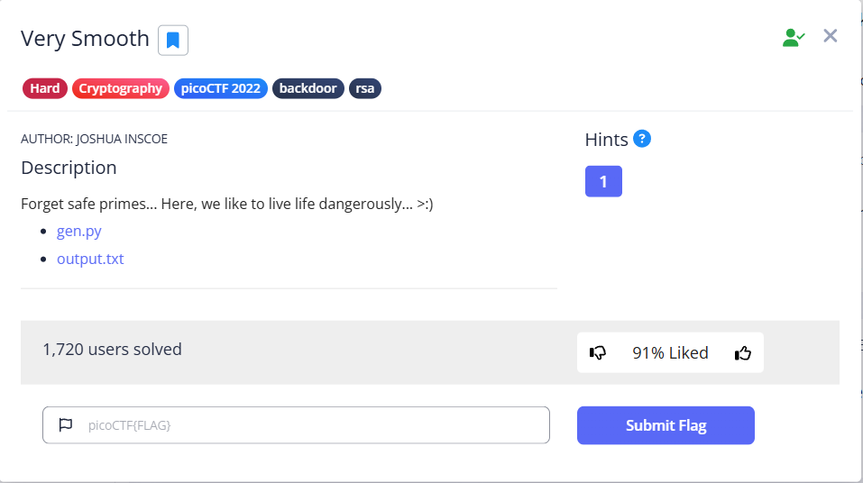

**CTF name**: Very Smooth

**Challenge description**: Someone created a program to read text files; we think the program reads files with root privileges but apparently it only accepts to read files that are owned by the user running it.

**Challenge category**: Binary Exploitation

**Challenge points**: Hard

