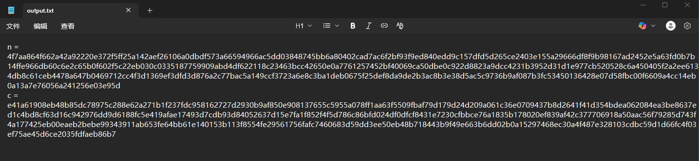
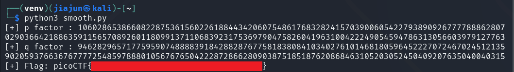

**CTF name**: Very Smooth

**Challenge description**: Someone created a program to read text files; we think the program reads files with root privileges but apparently it only accepts to read files that are owned by the user running it.

**Challenge category**: Binary Exploitation

**Challenge points**: Hard


## step 1: Understanding the encryption setup

**Analysis of output.txt**



The file output.txt contains two long hexadecimal values labeled as n and c:

n: the RSA modulus, which is the product of two large primes p * q.

c: the ciphertext, encrypted using the public key (n, e) (where e is commonly 0x10001).

**Analysis of gen.py**

```python
#!/usr/bin/python

from binascii import hexlify
from gmpy2 import *
import math
import os
import sys

if sys.version_info < (3, 9):
    math.gcd = gcd
    math.lcm = lcm

_DEBUG = False

FLAG  = open('flag.txt').read().strip()
FLAG  = mpz(hexlify(FLAG.encode()), 16)
SEED  = mpz(hexlify(os.urandom(32)).decode(), 16)
STATE = random_state(SEED)

def get_prime(state, bits):
    return next_prime(mpz_urandomb(state, bits) | (1 << (bits - 1)))

def get_smooth_prime(state, bits, smoothness=16):
    p = mpz(2)
    p_factors = [p]
    while p.bit_length() < bits - 2 * smoothness:
        factor = get_prime(state, smoothness)
        p_factors.append(factor)
        p *= factor

    bitcnt = (bits - p.bit_length()) // 2

    while True:
        prime1 = get_prime(state, bitcnt)
        prime2 = get_prime(state, bitcnt)
        tmpp = p * prime1 * prime2
        if tmpp.bit_length() < bits:
            bitcnt += 1
            continue
        if tmpp.bit_length() > bits:
            bitcnt -= 1
            continue
        if is_prime(tmpp + 1):
            p_factors.append(prime1)
            p_factors.append(prime2)
            p = tmpp + 1
            break

    p_factors.sort()

    return (p, p_factors)

e = 0x10001

while True:
    p, p_factors = get_smooth_prime(STATE, 1024, 16)
    if len(p_factors) != len(set(p_factors)):
        continue
    # Smoothness should be different or some might encounter issues.
    q, q_factors = get_smooth_prime(STATE, 1024, 17)
    if len(q_factors) != len(set(q_factors)):
        continue
    factors = p_factors + q_factors
    if e not in factors:
        break

if _DEBUG:
    import sys
    sys.stderr.write(f'p = {p.digits(16)}\n\n')
    sys.stderr.write(f'p_factors = [\n')
    for factor in p_factors:
        sys.stderr.write(f'    {factor.digits(16)},\n')
    sys.stderr.write(f']\n\n')

    sys.stderr.write(f'q = {q.digits(16)}\n\n')
    sys.stderr.write(f'q_factors = [\n')
    for factor in q_factors:
        sys.stderr.write(f'    {factor.digits(16)},\n')
    sys.stderr.write(f']\n\n')

n = p * q

m = math.lcm(p - 1, q - 1)
d = pow(e, -1, m)

c = pow(FLAG, e, n)

print(f'n = {n.digits(16)}')
print(f'c = {c.digits(16)}')
```

RSA Setup:
The script generates an RSA keypair where n = p × q, and e = 0x10001 (a standard public exponent).

Smooth Prime Construction:
The function get_smooth_prime() builds each prime (p and q) such that their factors are relatively small — this is known as a B-smooth number.
This design makes the modulus vulnerable to Pollard's p − 1 factorization method, which efficiently exploits such smoothness.

Encryption Logic:
A random flag is loaded from flag.txt, converted to an integer, and encrypted with RSA:

```python
c = pow(FLAG, e, n)
```

Security Flaw:
Since both p - 1 and q - 1 are composed of small prime factors, gcd(pow(a, B!) - 1, n) can leak p or q. 

Our goal is to iteratively increase the smoothness bound B until the GCD reveals one of the prime factors.  

Once either p or q is recovered, the RSA modulus n can be fully factored, and the private key d can be computed to decrypt the ciphertext.

## Step 2: Decription using code

To recover the plaintext flag, we use the following script to factor the RSA modulus and perform decryption based on our earlier analysis:

```python
from gmpy2 import fac
from math import gcd
from Crypto.Util.number import *
from sympy import true

n = 0x4f7aa864f662a42a92220e372f5ff25a142aef26106a0dbdf573a66594966ac5dd03848745bb6a80402cad7ac6f2bf93f9ed840edd9c157dfd5d265ce2403e155a29666df8f9b98167ad2452e5a63fd0b7b14ffe966db60c6e2c65b0f602f5c22eb030c0335187759909abd4df622118c23463bcc42650e0a7761257452bf40069ca50dbe0c922d8823a9dcc4231b3952d31d1e977cb520528c6a450405f2a2ee6134db8c61ceb4478a647b0469712cc4f3d1369ef3dfd3d876a2c77bac5a149ccf3723a6e8c3ba1deb0675f25def8da9de2b3ac8b3e38d5ac5c9736b9af087b3fc53450136428e07d58fbc00f6609a4cc14eb0a13a7e76056a241256e03e95d
c = 0xe41a61908eb48b85dc78975c288e62a271b1f237fdc958162727d2930b9af850e908137655c5955a078ff1aa63f5509fbaf79d179d24d209a061c36e0709437b8d2641f41d354bdea062084ea3be8637ed1c4bd8cf63d16c942976dd9d6188fc5e419afae17493d7cdb93d84052637d15e7fa1f852f4f5d786c86bfd024df0dfcf8431e7230cfbbce76a1835b178020ef839af42c377706918a50aac56f79285d743f4a177425eb00eaeb2bebe99343911ab653fe64bb61e140153b113f8554fe29561756fafc7460683d59dd3ee50eb48b718443b9f49e663b6dd02b0a15297468ec30a4f487e328103cdbc59d1d66fc4f03ef75ae45d6ce2035fdfaeb86b7
a = 2
B = 65535

while True:
    b = fac(B)

    tmp1 = n
    tmp2 = pow(a, b, n) - 1
    gcd_value = gcd(tmp1, tmp2)

    if gcd_value == 1:
        B += 1
    elif gcd_value == n:
        B -= 1
    else:
        print(f"[+] p factor : {gcd_value}")

        p = gcd_value
        q = n // p
        e = 0x10001

        print(f"[+] q factor : {q}")

        phi = (p - 1) * (q - 1)
        d = inverse(e, phi)

        m = pow(c, d, n)

        flag = long_to_bytes(m)

        try:
            print("[+] Flag:", flag.decode())

        except:
            print("[+] Flag (raw bytes):", flag)

        break
```

Explanation of code:

1. Parameters

```python
n = 0x4f7aa864f662a42a92220e372f5ff25a142aef26106a0dbdf573a66594966ac5dd03848745bb6a80402cad7ac6f2bf93f9ed840edd9c157dfd5d265ce2403e155a29666df8f9b98167ad2452e5a63fd0b7b14ffe966db60c6e2c65b0f602f5c22eb030c0335187759909abd4df622118c23463bcc42650e0a7761257452bf40069ca50dbe0c922d8823a9dcc4231b3952d31d1e977cb520528c6a450405f2a2ee6134db8c61ceb4478a647b0469712cc4f3d1369ef3dfd3d876a2c77bac5a149ccf3723a6e8c3ba1deb0675f25def8da9de2b3ac8b3e38d5ac5c9736b9af087b3fc53450136428e07d58fbc00f6609a4cc14eb0a13a7e76056a241256e03e95d
c = 0xe41a61908eb48b85dc78975c288e62a271b1f237fdc958162727d2930b9af850e908137655c5955a078ff1aa63f5509fbaf79d179d24d209a061c36e0709437b8d2641f41d354bdea062084ea3be8637ed1c4bd8cf63d16c942976dd9d6188fc5e419afae17493d7cdb93d84052637d15e7fa1f852f4f5d786c86bfd024df0dfcf8431e7230cfbbce76a1835b178020ef839af42c377706918a50aac56f79285d743f4a177425eb00eaeb2bebe99343911ab653fe64bb61e140153b113f8554fe29561756fafc7460683d59dd3ee50eb48b718443b9f49e663b6dd02b0a15297468ec30a4f487e328103cdbc59d1d66fc4f03ef75ae45d6ce2035fdfaeb86b7
a = 2
B = 65535
```

`n` is the RSA modulus given in the challenge.

`c` is the ciphertext (also provided).

`a = 2`: Base used for modular exponentiation.

`B` is the initial smoothness bound for Pollard’s p−1 method.

2. Main Loop

```python
while True:
    b = fac(B)

    tmp1 = n
    tmp2 = pow(a, b, n) - 1
    gcd_value = gcd(tmp1, tmp2)
```

`b = fac(B)`: Computes B! (factorial of B).

`pow(a, b, n)`: Computes 𝑎𝐵! mod 𝑛

`gcd(n, a^{B!} - 1)`: The heart of Pollard’s p−1 algorithm. If this GCD returns a non-trivial factor (i.e., != 1 and != n), it means we have found one of the primes (p or q).

3. GCD Evaluation

```python
if gcd_value == 1:
        B += 1
    elif gcd_value == n:
        B -= 1
    else:
        print(f"[+] p factor : {gcd_value}")
```

If `GCD` is 1 → no factor found, increase B.

If `GCD` equals n → overstep occurred, reduce B.

Else → we’ve found a factor (p), move to decryption.

4. Decrypting the Ciphertext

```python
 p = gcd_value
        q = n // p
        e = 0x10001

        print(f"[+] q factor : {q}")

        phi = (p - 1) * (q - 1)
        d = inverse(e, phi)

        m = pow(c, d, n)

        flag = long_to_bytes(m)
```

`q` is derived by dividing n by p.

`phi` is Euler's totient function (p−1)(q−1).

`d` is the modular inverse of e, giving the private key.

`m` is the decrypted plaintext integer.

flag converts the integer m back into readable bytes.

Summary: This script factors the RSA modulus using Pollard’s p−1 method and then reconstructs the private key to decrypt the ciphertext and reveal the flag.

After we executing this script, the flag successfully appear:


