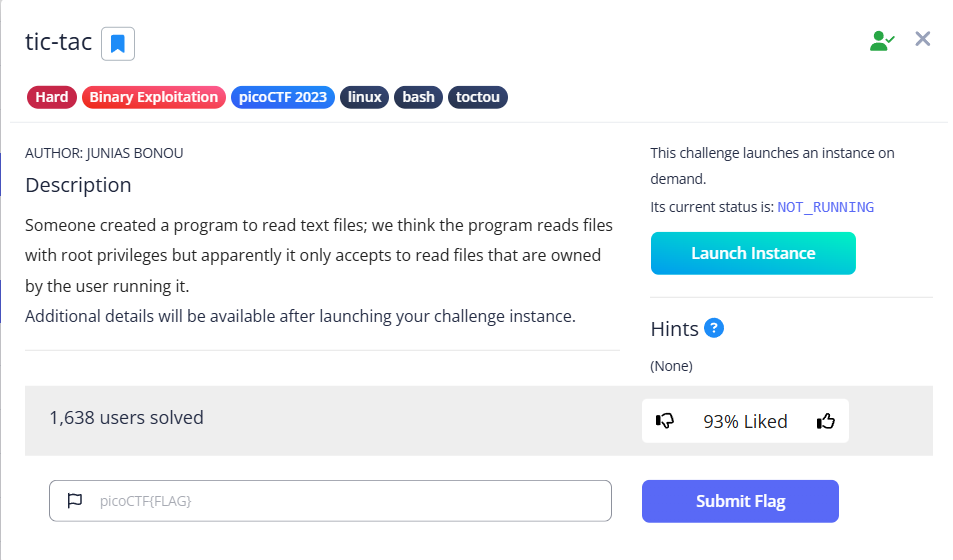
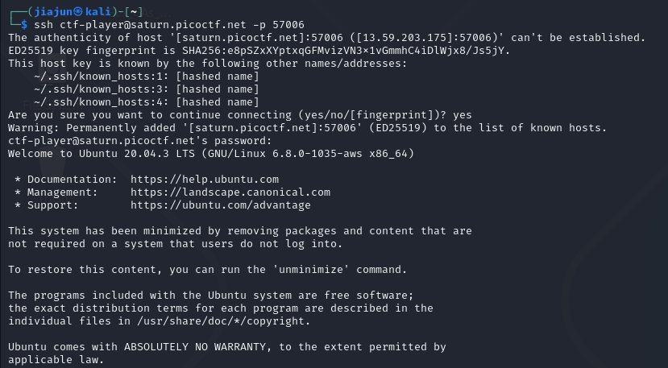
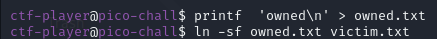
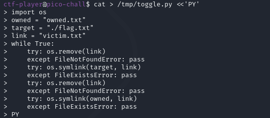
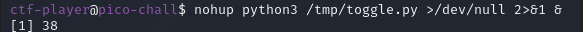
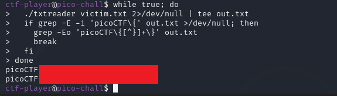

**CTF name**: tic-tac

**Challenge description**: Someone created a program to read text files; we think the program reads files with root privileges but apparently it only accepts to read files that are owned by the user running it.

**Challenge category**: Binary Exploitation

**Challenge points**: Hard



## Step 1: Connect to Instance

Use SSH to log in to the instance provided by picoCTF and enter the challenge environment.




## Step 2: Prepare local “bait” file and symlink

Since the program likely checks the ownership of the file before reading it, our first goal is to create a file we own. We’ll also prepare a symbolic link that initially points to that file. This setup allows us to later exploit the short gap between the program’s check 
and use by changing what the symlink points to. Create a file you own (owned.txt) as the bait, and make a symlink named victim.txt that points to it. Later we will flip that symlink to point at the real flag.txt.



## Step 3: Set up the fast toggling script

To exploit the time gap between the program’s check (e.g., checking file owner) and its use (actually opening the file), we need to rapidly switch the symlink victim.txt between two targets: the file we own (owned.txt) and the root-owned file we want to read (flag.txt). A Python script helps us automate this at high speed, increasing the chances of hitting the race condition.We therefore write a small script that repeatedly deletes and recreates the victim.txt symlink, flipping it between owned.txt and flag.txt. This script runs in the background while we invoke the target binary in a loop.



Why we need this script?

Because we don’t know exactly when the program performs the check and the open, we have to keep switching back and forth — hoping that the symlink points to owned.txt during the check and to flag.txt during the actual open.



Command explanation:

This command runs the toggling script in the background.

`nohup` ensures that the process keeps running even if the terminal is closed.

`python3 /tmp/toggle.py` executes the Python script responsible for rapidly switching the symlink.

`>/dev/null 2>&1` discards both standard output and standard error, so the script runs silently.

`&` runs the command in the background, allowing us to continue using the terminal for other commands.

## Step 4: Run the target program in a loop to trigger the race

Since the race condition depends on extremely precise timing, running the program just once is very unlikely to succeed. We need to call the binary in a tight loop, hoping that one of those executions lands during the brief moment when the symlink victim.txt points to flag.txt after the ownership check but before the file is opened.

Run txtreader on victim.txt repeatedly in a loop, and capture its output. If the output contains the flag pattern, stop the loop and extract the flag:



Code explanation:

```python
./txtreader victim.txt 2>/dev/null | tee out.txt
```
This runs the vulnerable program with victim.txt as input. Any error messages are suppressed (2>/dev/null), and the standard output is saved to a file named out.txt while still being displayed on the screen using tee.

```python
if grep -E -i 'picoCTF\{' out.txt >/dev/null;
```
This checks whether the output file contains a line with the string picoCTF{, ignoring case. If found, it indicates that the program has successfully printed the flag.

```python
grep -Eo 'picoCTF\{[^}]+\}' out.txt
```
This extracts the full flag from the output using a regular expression that matches the picoCTF{...} pattern.

And finally we successfully extract flag with two python script.
