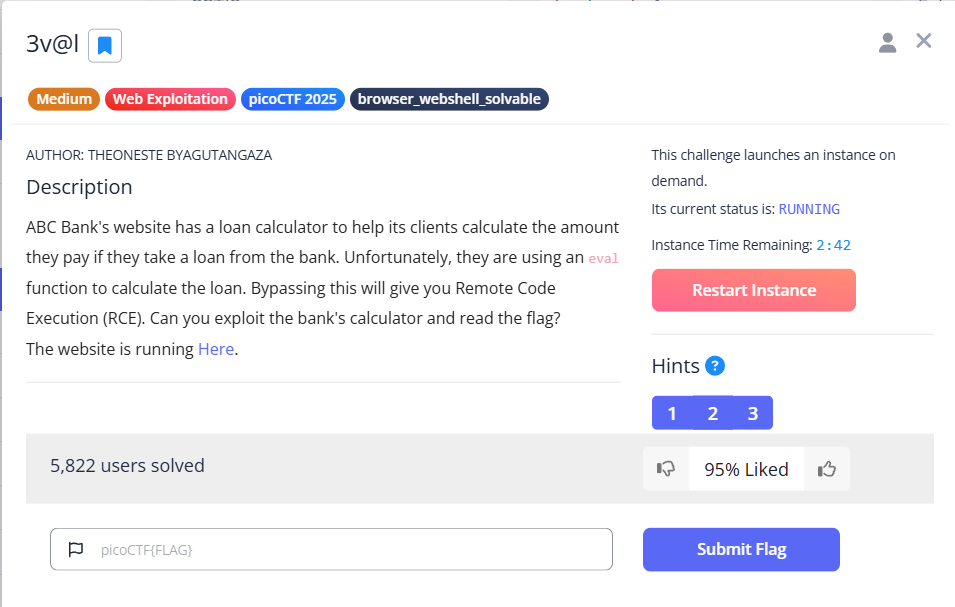
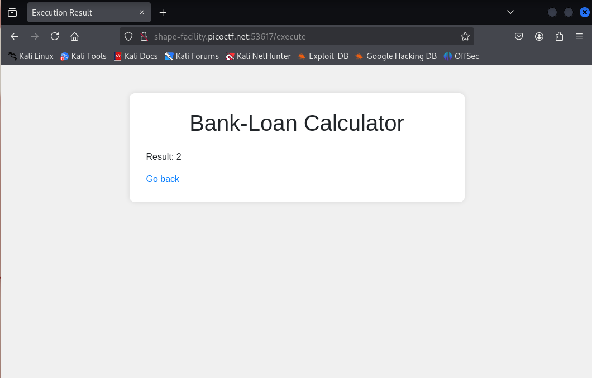
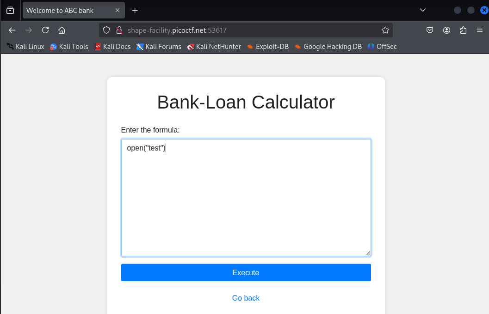
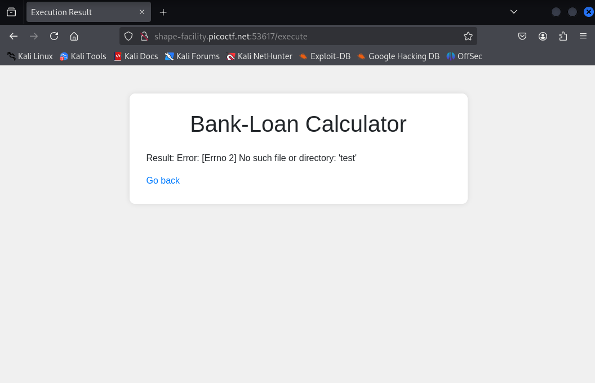

**CTF name**: 3v@l

**Challenge description**: ABC Bank's website has a loan calculator to help its clients calculate the amount they pay if they take a loan from the bank. Unfortunately, they are using an eval function to calculate the loan. Bypassing this will give you Remote Code Execution (RCE). Can you exploit the bank's calculator and read the flag?

**Challenge category**: web exploitation

**Challenge points**: medium



## Step 1: Basic Functional Test
After entering the challenge page, we will see a Bank-Loan Calculator input field. The page prompts user to enter a mathematical formula and click Execute to run it. To verify the backend processing logic, we first input a simple calculation:


The return result is 2.



This result indicates that:

The backend does execute the expressions we input.

It most likely uses Python's eval() function to process the input.

## Step 2: Functional Testing -- File Operation

Next, enter the following in the input field:

```kotlin
open("test")
```



This step is to verify whether file-related functions are allowed and can be executed in the current environment.  

The program returns:

```javascript
Error: [Errno 2] No such file or directory: 'test'
```



This indicates:

The `open()` function is available in the current environment;

The error occurs solely because the file `test` does not exist;

In other words, we possess the capability to directly read server files.


After confirming that open() is available, we attempt to read the flag file directly:
