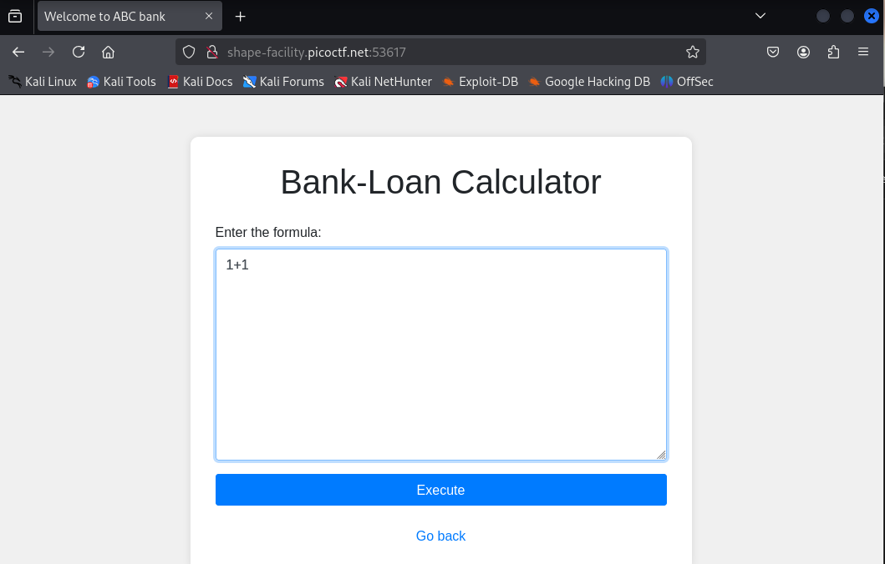

**CTF name**: 3v@l

**Challenge description**: ABC Bank's website has a loan calculator to help its clients calculate the amount they pay if they take a loan from the bank. Unfortunately, they are using an eval function to calculate the loan. Bypassing this will give you Remote Code Execution (RCE). Can you exploit the bank's calculator and read the flag?

**Challenge category**: web exploitation

**Challenge points**: medium

