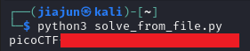

**CTF name**: Quantum Scrambler

**Challenge description**: We invented a new cypher that uses "quantum entanglement" to encode the flag. Do you have what it takes to decode it?

**Challenge category**: Reverse Engineering

**Challenge points**: medium


## Step 1: Launch Instance and Inspect Output

After launching the challenge instance using the provided Netcat connection, The output consists of a long scrambled structure made up of nested Python lists and hex values (e.g., [[0x70], [0x69], [], [0x63]]). This clearly represents an encoded version of the flag in some modified form of hex encoding.


## Step 2: Understand the Encoding Logic

Inspecting the server-side logic reveals the actual scrambling process. The provided Python script (quantum_scrambler.py) defines the encoding as follows:


Additionally, the flag is first converted to a list of hex strings via:

```python
hex_flag.append([str(hex(ord(c)))])
```

This means each character is converted to a hex string wrapped inside a list, and then repeatedly modified by inserting and appending between adjacent elements.

## Step 3: Save and Clean the Scrambled Data

We save the entire encrypted output to a local file named `cipher.txt` for subsequent parsing and processing. This is achieved through output redirection in Bash:

```bash
nc verbal-sleep.picoctf.net 54780 > cipher.txt
```
We then wrote a Python script called solve_from_file.py to extract the actual hex values from saved `cipher.txt` text file:


Code explanation:

```python
text = open("cipher.txt", "r", encoding="utf-8", errors="ignore").read()
obj = eval(text)
```

eval(text) safely interprets the content of cipher.txt as a Python object. The data is a list of lists with string representations of hex values like '0x70'.

```python
res = []
for outer in obj:
    for item in outer:
        if isinstance(item, str) and item.startswith("0x"):
            res.append(int(item, 16))
```

This loop traverses the nested list structure.

It checks whether each item is a string and whether it represents a hexadecimal value (prefixed with “0x”).

Valid hexadecimal strings are converted to integers using int(item, 16) and added to the res list.

```python
flag = bytes(res).decode("utf-8", errors="ignore")
print(flag)
```

Once all hex values are extracted and converted to bytes, we decode the byte array into a UTF-8 string, which reveals the original flag.

`errors="ignore"` ensures the program doesn't crash if invalid bytes are encountered during decoding.

## Step 4: execute script

After running the script, we successfully decoded the flag in standard picoCTF{} format:


