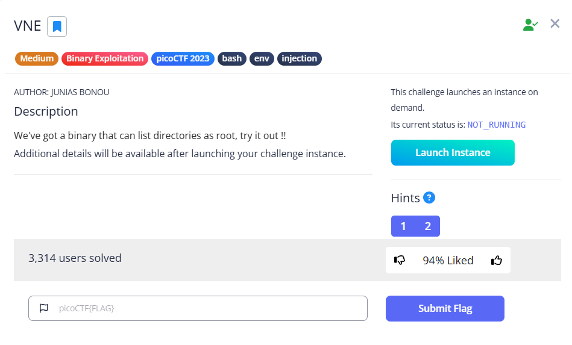
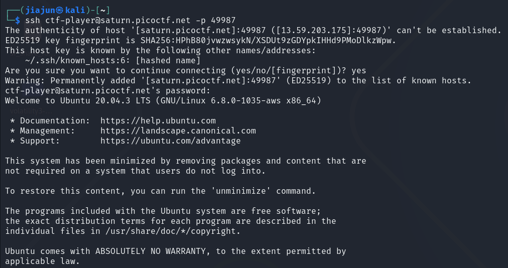
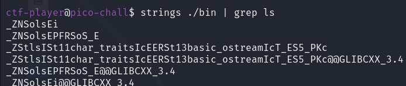
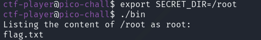
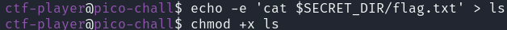
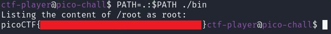

**CTF name**: VNE

**Challenge description**: We've got a binary that can list directories as root, try it out !!

**Challenge category**: binary exploitation

**Challenge points**: medium

## Step 1: Connect to the remote challenge instance

Connect to the remote challenge instance and password is provided in the challenge prompt：

## Step 2：Inspect the Binary

Before setting up the exploit, it's necessary to inspect the binary to determine how it handles system commands. Using `strings` on the binary, we look for any references to `ls` to check whether it is being called via an absolute path (e.g., `/bin/ls`) or just by name. If it's not hardcoded, we can hijack it later using a fake script and `PATH` injection.

## Step 3： Set the Environment Variable

Set the environment variable named `SECRET_DIR` so the binary can execute properly.

This variable is required by the program; if it is not defined, the binary will terminate with an error message. By assigning `/root` to `SECRET_DIR`, we can instruct the binary to access and list the contents of the `/root` directory. This step confirms the location of the target file `flag.txt` and prepares the environment for the next stage of the attack.

## Step 4: Create a Fake `ls` Script

Create a script named `ls` that mimics the system command but instead reads the flag file directly. This will allow us to hijack the behavior of the original binary, which calls `ls` without specifying a full path.

## Step 5: Override PATH and Execute the Binary

After the script created， we need to trigger the binary to execute the script instead of the real system command. 

The command `PATH=.:$PATH ./bin` temporarily updates the `PATH` variable so that the current directory (`.`) is searched first when looking for executables. As a result, when the binary calls `ls`, it runs the script from the current directory instead of `/bin/ls`.

When the binary is executed, it runs the script we created. As a result, it successfully reads and displays the contents of /root/flag.txt. The output confirms that the flag has been captured.
