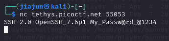
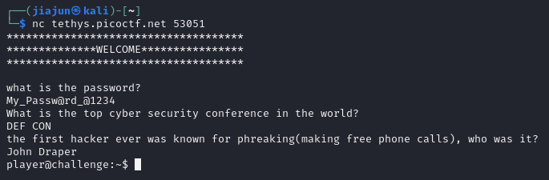
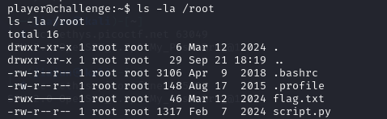
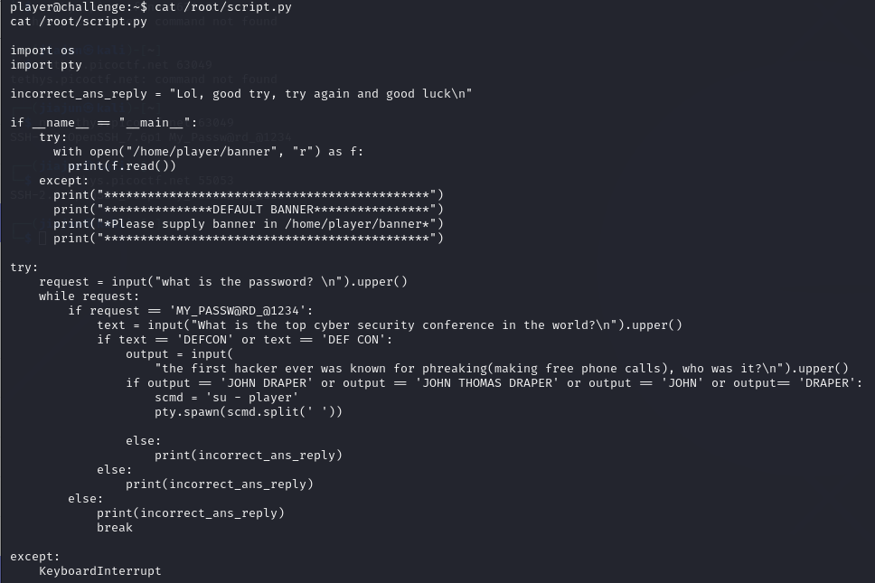
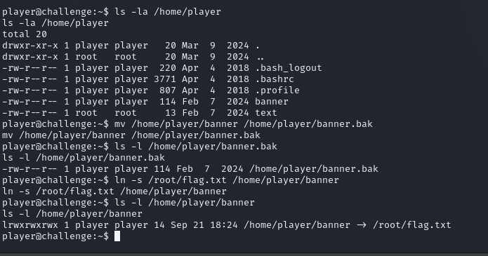
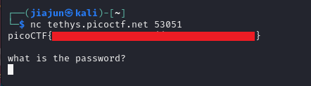

**CTF name**: dont-you-love-banners

**Challenge description**: Can you abuse the banner?

**Challenge category**: General Skill

**Challenge points**: medium


## Step 1： Connect to the Challenge and answer security questions

Start by connecting to the challenge service via netcat on the given port (in this case, 53051)， after connecting, the server asks for a password:


According to the challenge description, there's also a leaked information port provided:



Connect to that port the password `My_Passw@rd_01234` reveals.

After answering the rest of questions correctly, we get dropped into a shell:



## Step 2: Investigate the /root Directory

From the shell, we first check the /root directory:



We see two important files:

`flag.txt`: Likely the final flag — but it has -rwx------ permissions, so only root can read it.

`script.py`: This appears to be the backend script used by the challenge.

## Step 3: Analyze script.py

Show the contents of script.py and see the logic of this python script:



Script overview：

```python
with open("/home/player/banner", "r") as f:
    print(f.read())
```

This part of the script attempts to open and read the file `/home/player/banner`, and prints its contents to the client (us). Since the script is running as root, it can read any file on the system, including `/root/flag.txt`.

If the file doesn't exist or throws an error, the script prints a fallback message:

```python
except:
    print("***************DEFAULT BANNER***************")
    print("*Please supply banner in /home/player/banner*")
```

This shows that the script is expecting a banner file but does not verify ownership or type of the file — it just opens and reads whatever is at `/home/player/banner`.

## Step 4: Replace banner with a Symlink

Our goal is to trick the root-owned script into reading the contents of /root/flag.txt — a file we normally can't access as the player user. We can achieve this by replacing the original banner file with a symbolic link (symlink) that points to the flag.

（What is symlink?  A symlink is a shortcut that points to another file. When accessed, it redirects to the target file automatically.）

From the player shell, we perform the following:



Command explanation:

1. This command used to backup the original banner file.

```bash
mv /home/player/banner /home/player/banner.bak
```

2. Create a symbolic link pointing to the root flag.

```bash
ln -s /root/flag.txt /home/player/banner
```

3. Verify the symlink

```bash
ls -l /home/player/banner
```

And we can confirm that the symlink is successfully established through the output:

```bash
/home/player/banner -> /root/flag.txt
```

## Step 5: Reconnect and Retrieve the Flag

We now reconnect to the main service. In this time, when the script runs and tries to read /home/player/banner, it actually reads /root/flag.txt, and prints the flag to our terminal:



